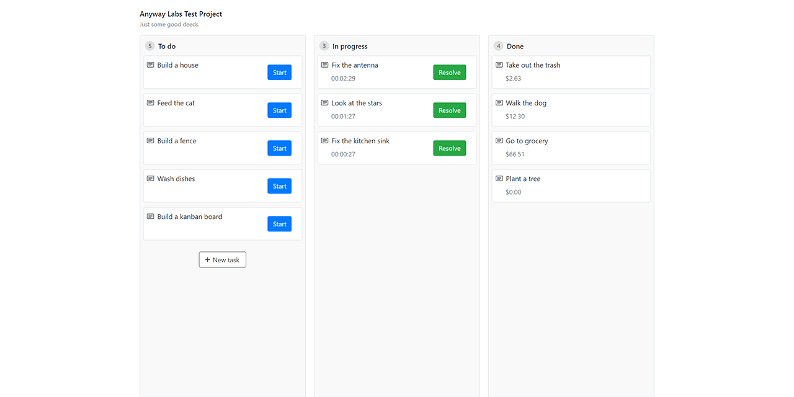

# Anyway Kanban Board
**Test assignment project**



Anyway Kanban sample job tasks application, build to use with an external API. Functionality includes creating new tasks, starting existing tasks with a time counter, and finishing tasks with calculating task price based on a hardcoded price/hour value.

* Current live version at [https://anyway.catlogic.ru/](https://anyway.catlogic.ru/)

---
## Technology used

### Frontend

* React (functional components, hooks)
* TypeScript
* JavaScript (ES6)
* Bootstrap
* Airbnb-typescript ESLint codestyle

### Backend

Sample Node/Express REST API (read only, no database) is used.

* [https://api.anyway.catlogic.ru/](https://api.anyway.catlogic.ru/)
    * GET /kanban - get tasks
    * POST /kanban - create a task
    ```json
    {
      "id": "123456",
      "task": "Feed the cat"
    }
    ```
    * PATCH /kanban/start - start a task
    ```json
    {
      "id": "123456",
      "date": "2021-02-07T19:24:00",
      "status": "progress"
    }
    ```
    * PATCH /kanban/finish - finish a task
    ```json
    {
      "id": "123456",
      "date": "2021-02-07T19:24:00",
      "status": "done"
    }
    ```
